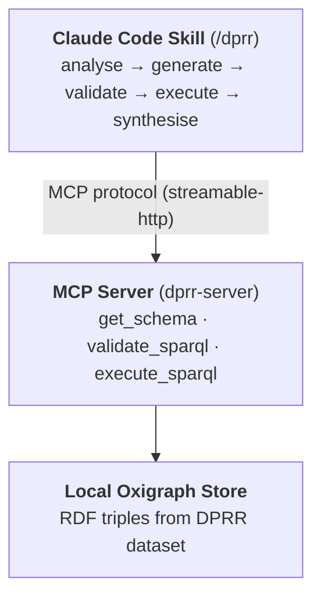
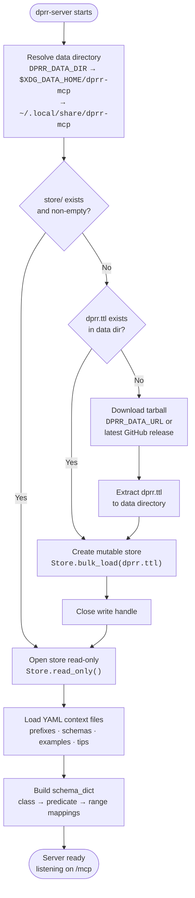
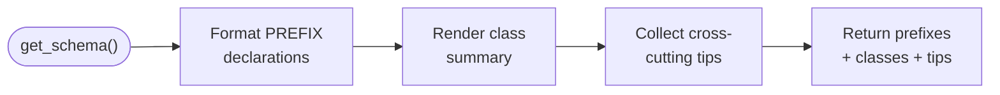
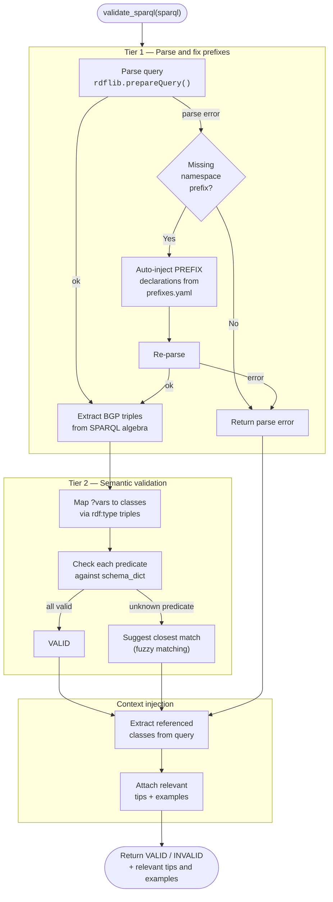
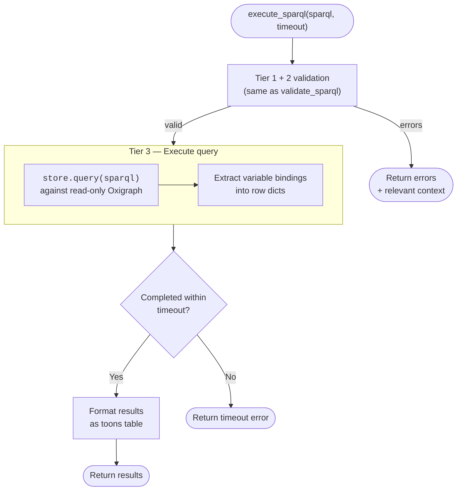

# Architecture Diagrams

## Overview

## Server Startup and Data Initialisation

On first startup the server auto-downloads the DPRR RDF dataset and initialises a local Oxigraph store. On subsequent startups the existing store is reopened read-only.

## Tool Execution

### get_schema

Returns the DPRR ontology overview. No query execution or store access.

### validate_sparql

Checks a query without executing it. Two-tier validation plus contextual guidance.

### execute_sparql

Validates then executes the query against the Oxigraph store.

